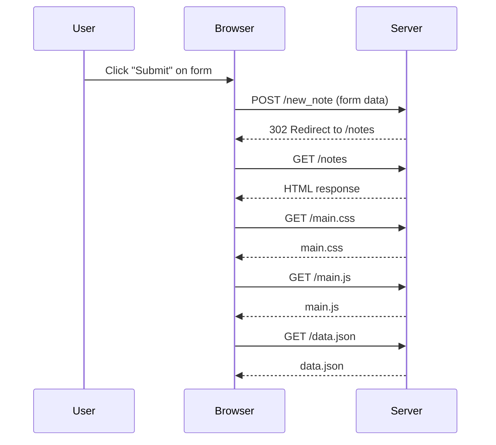

```mermaid
sequenceDiagram
    participant User
    participant Browser
    participant Server

    User->>Browser: Click "Submit" on form
    Browser->>Server: POST /new_note (form data)
    Server-->>Browser: 302 Redirect to /notes
    Browser->>Server: GET /notes
    Server-->>Browser: HTML response

    Browser->>Server: GET /main.css
    Server-->>Browser: main.css

    Browser->>Server: GET /main.js
    Server-->>Browser: main.js

    Browser->>Server: GET /data.json
    Server-->>Browser: data.json
```
