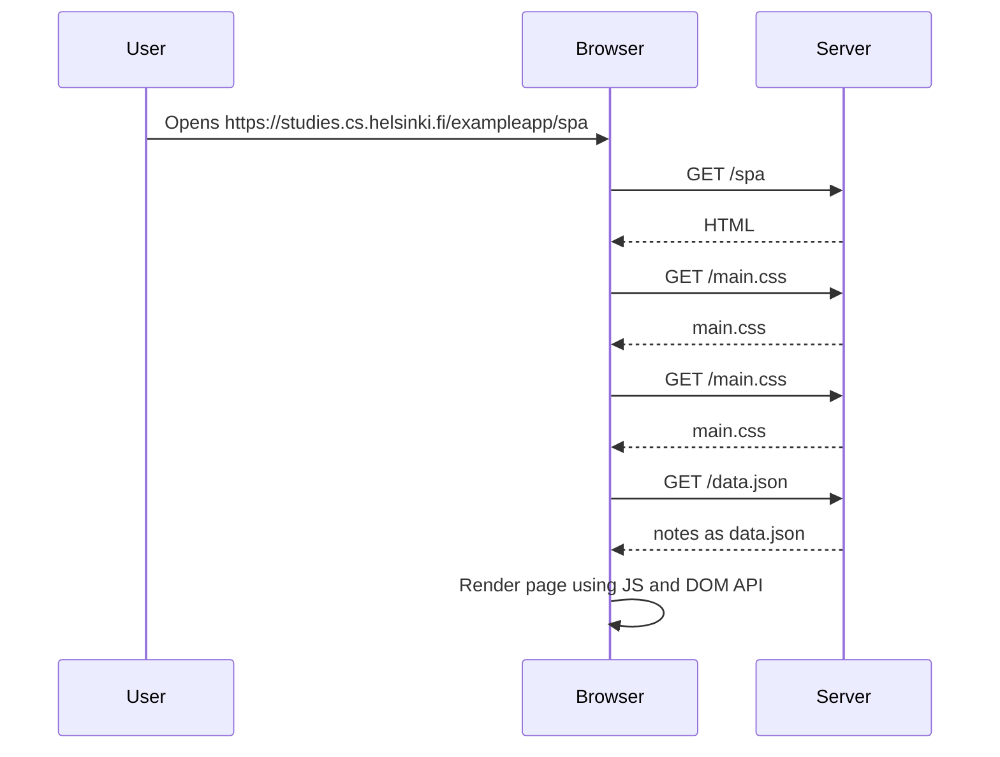

```mermaid
sequenceDiagram
    participant User
    participant Browser
    participant Server

    User->>Browser: Opens https://studies.cs.helsinki.fi/exampleapp/spa
    Browser->>Server: GET /spa
    Server-->>Browser: HTML
    Browser->>Server: GET /main.css
    Server-->>Browser: main.css

    Browser->>Server: GET /main.css
    Server-->>Browser: main.css

    Browser->>Server: GET /data.json
    Server-->>Browser: notes as data.json

    Browser->>Browser: Render page using JS and DOM API
```
